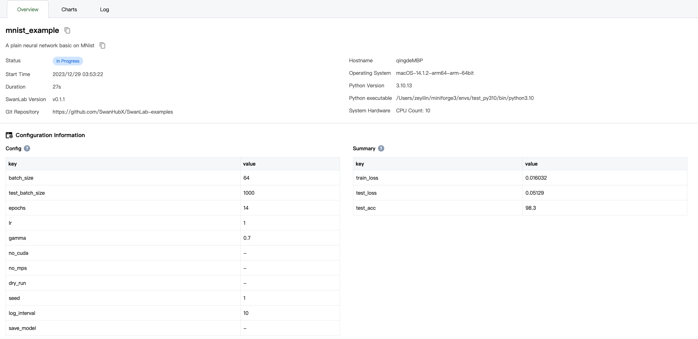
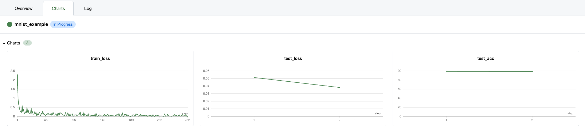

# Basic Mnist Example

This is a plain neural network training code. It's fork from [pytorch/examples](https://github.com/pytorch/examples/tree/main/mnist) and we will introduce how to use SwanLab in this code.


## Train

```shell
# make sure your python version >=3.8
pip install -r requirements.txt
python main.py
# CUDA_VISIBLE_DEVICES=2 python main.py  # to specify GPU id to ex. 2
```

SwanLab will track your `train_loss`、`test_loss` and `validation_acc`, start the experiment dashboard to visualize the results by running




