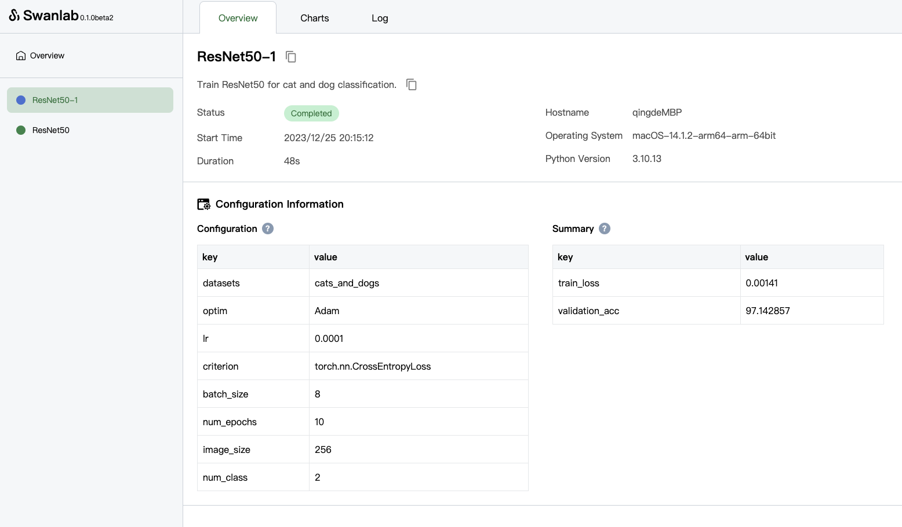
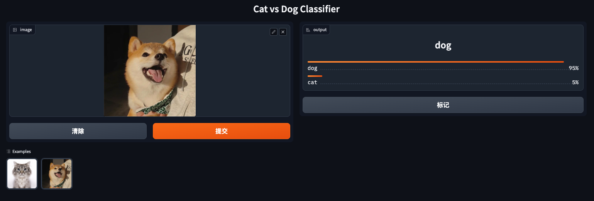

# ResNet50_Cats_vs_Dogs

This case includes:

- The fine-tuning of the pre-trained ResNet50 model on the cat and dog classification training set,
- Evaluates the accuracy on the test set
- Builds a Demo program based on [Gradio](https://www.gradio.app/) to verify the effectiveness of the trained checkpoint.

Among them, SwanLab plays a role in **recording hyperparameters**, **tracking metrics**, and **visualizing dashboards** in `train.py`.


# Pretrain

Install the necessary libraries.

```
pip install -r requirements.txt
```


## Download Dataset

Download the dataset to the `datasets` folder in this directory.

[Google Drive (9.9MB)](https://drive.google.com/file/d/11Pv0kzi56QMNoRrMOFuobnTwXREOLAMm/view?usp=drive_link)


## Train

You can start training by running

```
python train.py
```

SwanLab will track your `train_loss` and `validation_acc`, start the experiment dashboard to visualize the results by running

```
swanlab watch
```




## Demo

You can start Demo based on Gradio by running

```
python app.py
```




